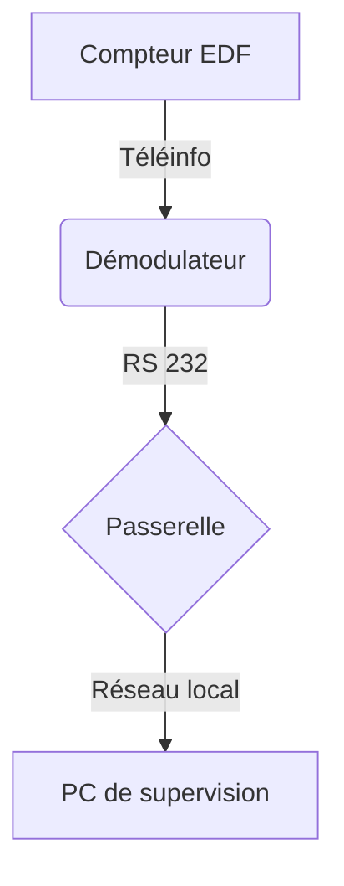
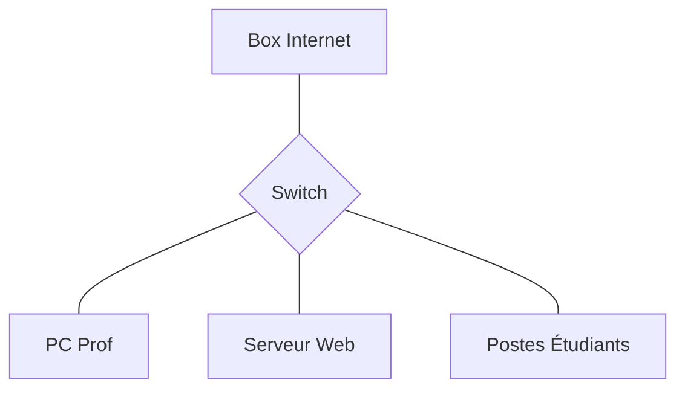
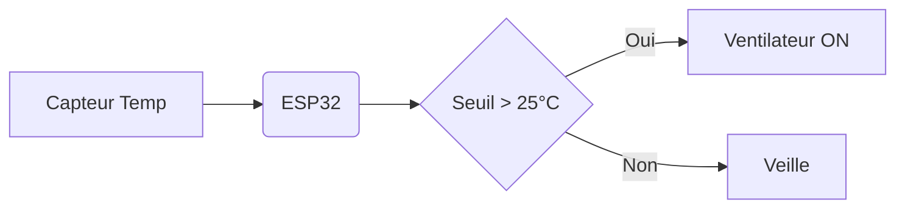
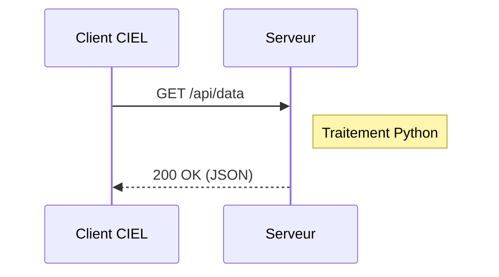
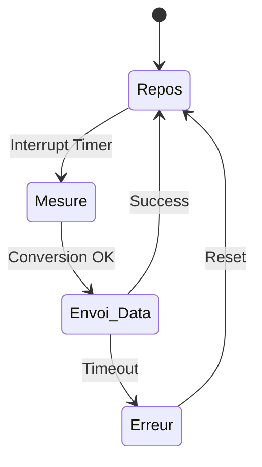

# Explication simple du script Python

Ce programme Python se connecte à un serveur `teleinfo` pour récupérer le numéro de série d’un compteur électrique.

---


# Fonctionnement du programme

## 1. Connexion au serveur

Le programme se connecte à l’adresse :

```text
192.168.1.241:2300
```

grâce à une socket TCP.

---

## 2. Lecture des données

Le serveur envoie des trames `teleinfo`.

Le programme les récupère avec :

```python
s.recv(1024)
```

---

## 3. Recherche de `ADCO`

Le script cherche la ligne contenant :

```text
ADCO
```

Cette ligne contient le numéro de série du compteur.

---

## 4. Extraction du numéro

Le numéro est extrait puis affiché :

```python
print(f"Numéro de série : {numeroSerie}")
```

---

# Exemple

Trame reçue :

```text
ADCO 123456789012 X
```

Résultat affiché :

```text
Numéro de série : 123456789012
```

---





##### 2. Diagrammes horizontaux


##### 3. Diagrammes de séquence



##### 4. Diagrammes d'état

